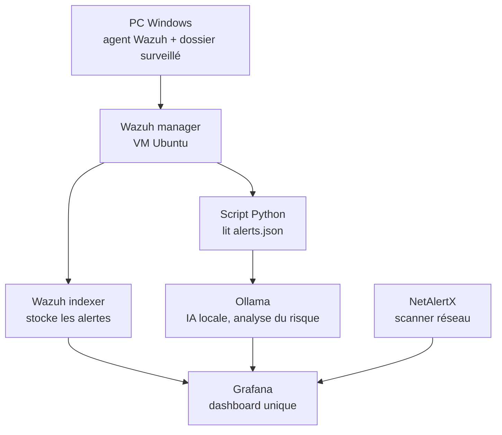

# Labo SOC — Wazuh + NetAlertX + Grafana + IA locale (Ollama)

Un labo de surveillance de sécurité complet et 100% auto-hébergé : un repertoire est surveillé sur un poste windows et les changements de fichiers sont détectés par Wazuh, chaque événement est automatiquement analysé par une IA tournant en local (Ollama), les appareils du réseau sont inventoriés par NetAlertX, et tout est visualisé sur un seul dashboard Grafana.

Aucun service IA cloud, aucune licence payante, aucune donnée qui sort du labo — tout le pipeline tourne sur une seule VM Ubuntu et un poste client Windows.

## Pourquoi ce projet

La plupart des dashboards Wazuh publics s'arrêtent aux alertes brutes. Ce labo ajoute une étape d'analyse IA : chaque événement de surveillance de fichiers (File Integrity Monitoring) est automatiquement résumé, noté sur un score de risque (0-100), avec des actions recommandées — avant même qu'un humain ne le regarde. Il illustre aussi l'adaptation d'une architecture initialement dépendante du cloud (le guide de départ utilisait un agent IA SaaS) vers une solution entièrement auto-hébergée et fonctionnant hors-ligne, suite à un blocage d'accès au service cloud.

## Architecture

**Deux pipelines indépendants alimentent un seul dashboard :**
- **Pipeline sécurité** : agent Windows → Wazuh manager → Wazuh indexer (via Filebeat) *et* → un script Python maison → modèle Ollama local → analyse notée sur un score de risque
- **Pipeline réseau** : NetAlertX scanne le réseau local indépendamment et expose un inventaire des appareils via une API

Grafana ne stocke rien lui-même — il interroge les trois sources en direct (l'Indexer Wazuh via OpenSearch, NetAlertX et le script via le plugin Infinity) et les affiche ensemble.

## Stack technique

| Composant | Rôle |
|---|---|
| Wazuh 4.14 (manager + indexer) | Surveillance des postes, détection de changements de fichiers (FIM), stockage des alertes |
| Filebeat | Transporte les alertes du manager vers l'Indexer Wazuh |
| NetAlertX | Découverte et inventaire passif des appareils réseau |
| Ollama (llama3.2:3b) | Modèle de langage local et hors-ligne qui note et résume chaque événement FIM |
| Service Python maison (Flask + waitress) | Lit en continu le journal d'alertes Wazuh, transmet les événements pertinents à Ollama, expose les résultats via une petite API REST |
| Grafana (plugins OpenSearch + Infinity) | Dashboard unique réunissant les trois sources de données |

## Pourquoi Ollama plutôt qu'un agent IA cloud

Le design d'origine prévoyait un agent IA SaaS (Airia ai). L'inscription en libre-service n'était pas disponible pour cette région au moment de la construction du labo, donc l'étape d'analyse IA a été réimplémentée avec un **modèle Ollama local** :
- Même prompt système / barème de notation du risque, envoyé cette fois comme message système du modèle
- Même contrat de sortie JSON, donc le reste du pipeline (stockage, panels Grafana) n'a nécessité aucun changement
- Modèle choisi après avoir testé plusieurs tailles selon la RAM disponible sur la VM du labo : un modèle 8B donnait la meilleure qualité de réponse mais provoquait un swap mémoire important (plus d'1 minute par analyse) ; un modèle 1B était rapide mais ignorait le format de sortie attendu ; **llama3.2:3b** offrait le meilleur compromis qualité/vitesse (~4s par analyse une fois chargé en mémoire)

## Panels du dashboard

- **FIM events** (stat) — nombre d'événements de surveillance de fichiers sur la période sélectionnée
- **Wazuh FIM event table** — chaque ajout/modification/suppression avec agent, chemin du fichier, règle déclenchée et empreinte
- **Device inventory** — liste en direct des appareils vus sur le réseau (nom, IP, MAC, statut)
- **AI risk gauge** — score de risque du dernier événement (0-100), coloré selon la gravité
- **Latest alert name** — le titre donné par l'IA au dernier événement
- **Latest AI summary** — détail complet : gravité, confiance, résumé, actions recommandées
- **Analysis history** — historique de toutes les analyses IA produites

## Problèmes réels résolus pendant la construction

- **Certificat TLS mal configuré** : le certificat de l'Indexer Wazuh ne listait que `127.0.0.1` dans son SAN, ce qui cassait toute connexion HTTPS distante (par IP). Corrigé en régénérant uniquement le certificat de l'Indexer avec `wazuh-certs-tool.sh -wi`, re-signé par le root CA existant (sans toucher à la confiance du manager/dashboard).
- **Panne silencieuse de Filebeat** : Filebeat pointait vers `127.0.0.1:9200` au lieu de la vraie IP de la VM, et échouait silencieusement à transmettre les alertes à l'Indexer depuis plusieurs jours — invisible jusqu'à l'inspection directe de son fichier de log dédié.
- **Pièges du plugin Grafana Infinity** : confusion entre les parseurs JQ et JSONata, blocage de sécurité "Allowed hosts" empêchant les appels sortants, et noms de champs réels de l'API (`devLastIP`, `devMac`) différents de ceux documentés (`devIP`, `devMAC`).
- **Choix d'un modèle IA adapté aux ressources** : benchmark itératif de plusieurs tailles de modèle en fonction de la RAM réellement disponible sur la VM, plutôt que de supposer que le plus gros modèle disponible fonctionnerait.

## Auteur

Yanice Gérald Guéswendé Nikiéma — Technicien support IT, en cours de spécialisation cybersécurité.
[GitHub](https://github.com/Yanice0) · [LinkedIn](https://linkedin.com/in/yanice-gérald-gueswende-nikiema-45620b273)
